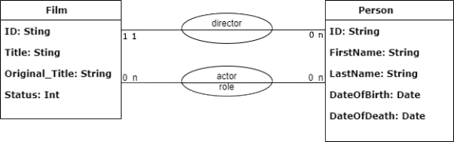

# FilmQL 🎬  

 

 
Project made as a graphQL cours correction.
It is made in diverse language in order to show different implementation.

***
## Rules of the project:

We are going to make a mini database for film. You can use a date base, store all in XML or just create a game data in
hard on the code for this exercise.

### A Film :
It is compose of :
- an Id
- an original title
- a french title
- the release date
- the director
- a list of all actors
- the state of the film (`IN_PROGRESS`, `RELEASED`, `ABANDONED`)

example 1

    The film 'Le Parrain', with the original title 'The Godfather' was released in 1972. It was directed by Francis Ford
    Coppola. The main actors are Marlon Brando, Al Pacino and Robert Duvall.

example 2

    The film 'OSS 117 : Alert rouge en Afrique noire', is in progress. It is directed by Nicolas Bedos. The main actors
    are  Jean Dujardin and Pierre Niney.

### A Director :
It is compose of :
- an ID
- a firstname
- a lastname
- a birthdate
- a deatdate
- a list of film

example

    Quentin Tarantino is born on March 27, 1963. He relised Pulp Fiction, Reservoir Dogs and Kill Bill.

### An Actor :
It is compose of :
- an ID
- a firstname
- a lastname
- a birthdate
- a deatdate
- a list of role (film + his character's name)

example

    Jim Carrey is born in January 17, 1962. He plays Truman Burbank in The Truman Show, Joël Barish in Eternal Sunshine of
    the spotless Mind and Carl Allen in Yes Man.

### Exercise :

1. Make the GraphQL schema
2. create de query `films`, which return all film (only the scalar type)
3. create de query `director(id: ID!)`, which return a director for the given id (null if he doesn't exist)
4. create de query `actor(id: ID!)`, which return an actor for the given id (null if he doesn't exist)
5. add to the `films` query the ***director*** resources.
6. add to the `films` query the ***actors*** resources.
7. add to the `director(id: ID!)` query the ***films*** resources
8. add to the `actor(id: ID!)` query the ***roles*** resources
9. create the query `people`, which return all people. If the person is an actor, we can see its list of role. If the
   person is a director, we can see its list of film.
10. create the mutation `createFilm(film: FilmInput!)`, which create a film in database.
11. create the mutation `createPerson(film: PersonInput!)`, which create a person in database.
12. create the query `search(term : String!)`, which find any data with this term.
    For example, the term `har` we can have : `Harry Potter` ; `Harrison Ford` ; `Neil Patrick Harris`

Go further :

13. use the dataloader for performance issue.
14. create a subscription to see all new film.
15. Create a front to use your APIs

***

tips : a litle database schema to help you

